# Brazil-Bench Organization Architecture

## System Overview

```mermaid
flowchart TB
    subgraph GH["☁️ GitHub Organization: brazil-bench"]
        direction TB

        subgraph Repos["Repositories"]
            POUR[("📦 pourpoise<br/><i>Evaluation & Coordination</i>")]
            TMPL[("📦 benchmark-template<br/><i>Spec + Empty Scaffold</i>")]

            subgraph Attempts["Attempt Repositories"]
                A1[("📦 2025-09-30-python-swarm")]
                A2[("📦 2025-10-30-python-hive")]
                A3[("📦 2025-12-01-python-claude-beads")]
                AN[("📦 YYYY-MM-DD-lang-pattern")]
            end
        end
    end

    subgraph CS1["🖥️ Codespace A: Pourpoise"]
        direction TB
        CC1["🤖 Claude Code<br/>(Opus 4.5)"]
        SKILLS["📋 Skills/SOPs<br/>• create-attempt<br/>• evaluate-attempt<br/>• compare-attempts"]
        RESULTS["📊 Results<br/>• Evaluations<br/>• Leaderboard<br/>• Summaries"]

        CC1 --> SKILLS
        SKILLS --> RESULTS
    end

    subgraph CS2["🖥️ Codespace B: Attempt Execution"]
        direction TB
        LLM["🤖 Custom LLM Setup<br/>• Claude + Swarm<br/>• Claude + Hive Mind<br/>• Claude + Beads<br/>• GPT-4 / Gemini / etc."]
        NEO["🗄️ Neo4j<br/>(Docker)"]
        CODE["💻 Implementation<br/>• MCP Server<br/>• Tests<br/>• Data Loaders"]

        LLM --> CODE
        CODE --> NEO
    end

    %% Relationships
    TMPL -->|"Use this template"| AN
    POUR -->|"gh repo clone"| Attempts
    CC1 -->|"Evaluate"| RESULTS

    %% Styling
    classDef github fill:#24292e,color:#fff,stroke:#fff
    classDef codespace fill:#0366d6,color:#fff,stroke:#fff
    classDef repo fill:#28a745,color:#fff,stroke:#fff
    classDef component fill:#6f42c1,color:#fff,stroke:#fff

    class GH github
    class CS1,CS2 codespace
    class POUR,TMPL,A1,A2,A3,AN repo
    class CC1,LLM,SKILLS,RESULTS,NEO,CODE component
```

## Workflow Sequence

```mermaid
sequenceDiagram
    autonumber
    participant User as 👤 User
    participant Pour as 🖥️ Pourpoise Codespace
    participant GH as ☁️ GitHub
    participant Attempt as 🖥️ Attempt Codespace
    participant LLM as 🤖 Custom LLM

    Note over User,LLM: Phase 1: Create Attempt
    User->>GH: Create repo from benchmark-template
    GH-->>User: New attempt repo created

    Note over User,LLM: Phase 2: Run Benchmark
    User->>Attempt: Open Codespace
    User->>Attempt: Install LLM (Claude/GPT/etc)
    User->>LLM: "Implement brazilian-soccer-mcp-guide.md"

    loop Autonomous Development
        LLM->>Attempt: Read spec
        LLM->>Attempt: Write code
        LLM->>Attempt: Run tests
        LLM->>Attempt: Fix issues
    end

    LLM->>Attempt: Commit changes
    Attempt->>GH: Push to repo
    User->>Attempt: Save prompts.txt

    Note over User,LLM: Phase 3: Evaluate
    User->>Pour: "evaluate attempt YYYY-MM-DD-..."
    Pour->>GH: Clone attempt repo
    Pour->>Pour: Analyze code, tests, git history
    Pour->>Pour: Generate evaluation report
    Pour->>GH: Push results

    Note over User,LLM: Phase 4: Compare
    User->>Pour: "compare attempts"
    Pour->>Pour: Aggregate all evaluations
    Pour->>Pour: Calculate scores & rankings
    Pour->>GH: Update LEADERBOARD.md
```

## Repository Structure

## Environment Comparison

```mermaid
flowchart LR
    subgraph PourEnv["Pourpoise Environment"]
        direction TB
        PC["Claude Code<br/>(Standard)"]
        PG["GitHub CLI"]
        PP["Python + Skills"]
    end

    subgraph AttemptEnv["Attempt Environment"]
        direction TB
        AL["LLM + Orchestration<br/>• Claude Flow (Swarm/Hive)<br/>• Beads<br/>• Custom Setup"]
        AD["Docker<br/>• Neo4j"]
        AP["Python 3.10+<br/>• MCP<br/>• pytest-bdd"]
    end

    PourEnv -->|"Creates & Evaluates"| AttemptEnv
```

## Orchestration Patterns Compared

```mermaid
flowchart TB
    subgraph Swarm["Swarm Pattern"]
        direction TB
        S1["64 Available Agents"]
        S2["Dynamic Coordination"]
        S3["MCP Memory Tools"]
        S1 --> S2 --> S3
    end

    subgraph Hive["Hive Mind Pattern"]
        direction TB
        H1["4 Parallel Agents"]
        H2["Researcher"]
        H3["Coder"]
        H4["Tester"]
        H5["Analyst"]
        H1 --> H2 & H3 & H4 & H5
    end

    subgraph Beads["Beads Pattern"]
        direction TB
        B1["Issue Tracking"]
        B2["Sequential Phases"]
        B3["Single Agent"]
        B1 --> B2 --> B3
    end

    Swarm -->|"~109 min<br/>8,683 LOC"| Result
    Hive -->|"~41 min<br/>3,545 LOC"| Result
    Beads -->|"~11 min<br/>1,826 LOC"| Result

    Result["✅ MCP Server<br/>+ Tests<br/>+ Neo4j"]
```

## Data Flow

```mermaid
flowchart LR
    subgraph Input
        SPEC["📄 Spec<br/>brazilian-soccer-<br/>mcp-guide.md"]
        DATA["📊 Kaggle Data<br/>(Optional)"]
    end

    subgraph Processing["Attempt Codespace"]
        LLM["🤖 LLM"]
        MCP["MCP Server"]
        DB["Neo4j"]
        TEST["Tests"]
    end

    subgraph Output
        CODE["💻 Implementation"]
        PROMPT["📝 prompts.txt"]
        COMMIT["📦 Git Commits"]
    end

    subgraph Evaluation["Pourpoise Codespace"]
        EVAL["📊 Evaluation"]
        REPORT["📋 Report"]
        LEAD["🏆 Leaderboard"]
    end

    SPEC --> LLM
    DATA --> LLM
    LLM --> MCP --> DB
    LLM --> TEST
    MCP --> CODE
    LLM --> PROMPT
    CODE --> COMMIT

    COMMIT --> EVAL
    PROMPT --> EVAL
    EVAL --> REPORT --> LEAD
```

## Key Components

| Component | Location | Purpose |
|-----------|----------|---------|
| **Pourpoise** | Codespace A | Coordination, evaluation, leaderboard |
| **benchmark-template** | GitHub | Spec + scaffold for new attempts |
| **Attempt repos** | Codespace B | LLM implementation environment |
| **Claude Code** | Pourpoise | Runs SOPs and evaluations |
| **Custom LLM** | Attempt | Implements the benchmark |
| **Neo4j** | Attempt (Docker) | Graph database for MCP server |
| **Skills/SOPs** | Pourpoise | Standardized procedures |
| **Results** | Pourpoise | Evaluation reports and leaderboard |

## Security Model

```mermaid
flowchart TB
    subgraph Safe["✅ Safe Environment"]
        POUR["Pourpoise<br/>(Read-only operations)"]
    end

    subgraph Isolated["🔒 Isolated Environment"]
        ATT["Attempt Codespace<br/>(--dangerously-skip-permissions)"]
    end

    subgraph Protected["🛡️ Protected"]
        GH["GitHub Repos"]
    end

    POUR -->|"Clone (read)"| GH
    POUR -->|"Push results"| GH
    ATT -->|"Push implementation"| GH

    ATT -.->|"No access to"| POUR
```

The isolation ensures:
- LLM-generated code runs only in dedicated Codespaces
- Pourpoise only performs read operations on attempt repos
- Each attempt is fully contained and reproducible
