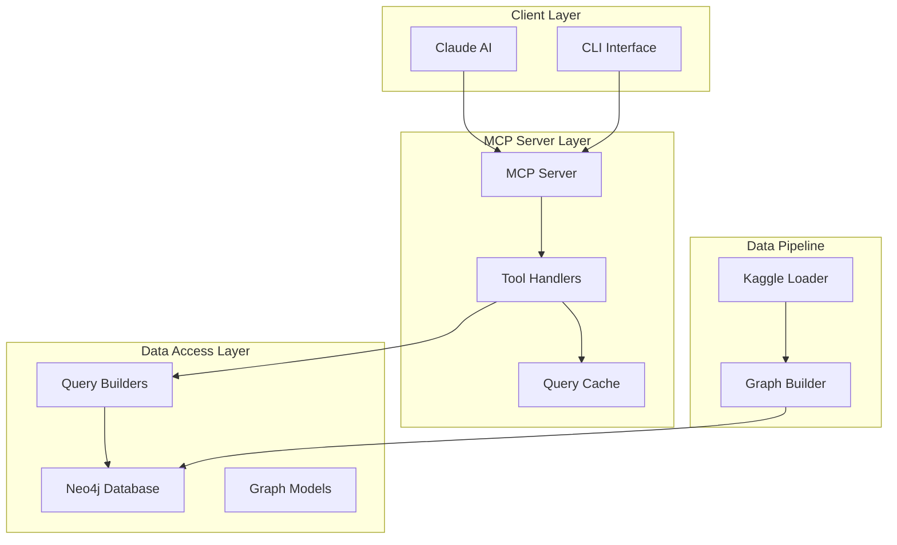
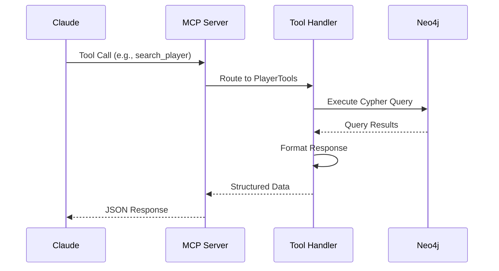
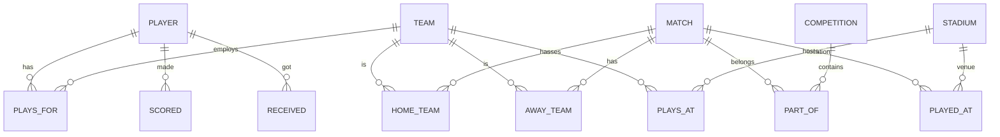

# System Architecture

## Overview

The Brazilian Soccer MCP Knowledge Graph follows a layered architecture designed for extensibility and separation of concerns.

## Design Patterns

### 1. Model Context Protocol (MCP)
The system implements the MCP specification for Claude AI integration:
- **Server:** Handles initialization, capability negotiation
- **Tools:** 13 specialized query tools exposed to Claude
- **Resources:** Schema documentation and help content

### 2. Repository Pattern
Database access is abstracted through the `Neo4jDatabase` class:
- Connection pooling and session management
- Transaction support for batch operations
- Query caching for performance

### 3. Builder Pattern
Graph construction uses a systematic builder approach:
- Entities created in dependency order
- Batch processing for large datasets
- Rollback capability on failure

### 4. Data Transfer Objects
Entity models use Python dataclasses:
- Type-safe attribute definitions
- Automatic serialization to Neo4j properties
- Enum support for constrained values

## Data Flow

## Graph Database Schema

## Performance Considerations

| Aspect | Strategy |
|--------|----------|
| Query Caching | 30-minute TTL in-memory cache |
| Connection Pooling | Max 50 connections |
| Batch Operations | 1000 records per batch |
| Indexing | Indexes on frequently queried properties |
| Constraints | Unique constraints on entity IDs |

## Error Handling Strategy

1. **Connection Errors:** Automatic reconnection with exponential backoff
2. **Query Errors:** Logged with full context, graceful degradation
3. **Tool Errors:** Returned as structured error messages to Claude
4. **Validation Errors:** Pre-execution parameter validation
