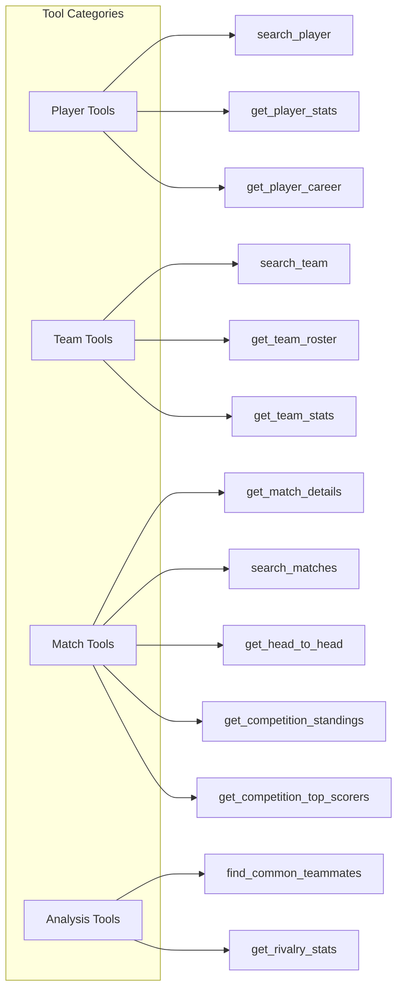
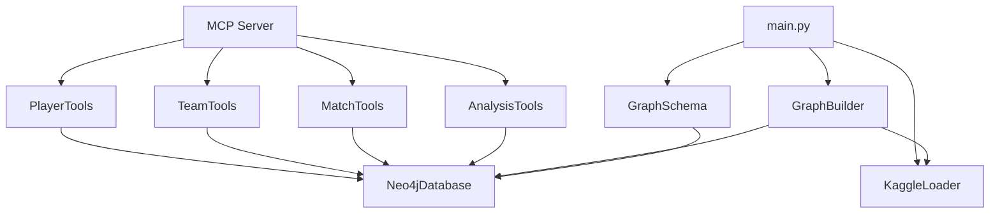

# Components

## Core Components

### 1. MCP Server (`src/mcp_server/server.py`)

The main server component implementing the Model Context Protocol.

**Responsibilities:**
- Initialize MCP protocol handlers
- Register available tools and resources
- Route tool calls to appropriate handlers
- Manage Neo4j database connection
- Implement caching layer

**Key Class:** `BrazilianSoccerMCPServer`
- Maintains singleton server instance
- Handles async operations via asyncio
- Provides help content and schema information

### 2. Neo4j Database Layer (`src/graph/database.py`)

Database abstraction providing connection management and query execution.

**Responsibilities:**
- Establish and maintain database connections
- Manage connection pooling
- Execute Cypher queries (read/write)
- Handle transactions
- Provide schema information

**Key Classes:**
- `Neo4jDatabase` - Main database interface
- `Neo4jConnectionError` - Connection exception
- `Neo4jQueryError` - Query execution exception

### 3. Graph Schema Models (`src/graph/models.py`)

Entity definitions and schema management for the knowledge graph.

**Entity Types:**
| Entity | Description | Key Properties |
|--------|-------------|----------------|
| Player | Soccer players | name, position, nationality |
| Team | Soccer clubs | name, city, stadium_name |
| Match | Individual matches | date, home_score, away_score |
| Competition | Tournaments/leagues | name, type, format |
| Stadium | Soccer venues | name, city, capacity |
| Coach | Team coaches | name, nationality |
| Season | Competition seasons | year, is_current |
| Goal | Goals scored | minute, type |
| Card | Yellow/red cards | minute, type |
| Transfer | Player transfers | transfer_date, fee |

**Schema Management:** `GraphSchema` class handles constraints and indexes

### 4. Kaggle Loader (`src/data_pipeline/kaggle_loader.py`)

Data loading and parsing component for CSV datasets.

**Responsibilities:**
- Load CSV files with encoding detection
- Normalize Portuguese text and team names
- Extract entities from raw data
- Generate sample data for testing
- Validate data consistency

**Key Features:**
- UTF-8 and Latin-1 encoding support
- Team name standardization
- Sample data generation for development

### 5. Graph Builder (`src/data_pipeline/graph_builder.py`)

Orchestrates graph population from parsed data.

**Responsibilities:**
- Create entities in dependency order
- Establish relationships between nodes
- Manage batch operations
- Validate graph integrity
- Track build statistics

**Loading Order:**
1. Competitions, Stadiums (independent)
2. Teams, Coaches (independent)
3. Players, Seasons (independent)
4. Matches (depends on teams)
5. Goals, Cards, Transfers (depends on matches/players)

### 6. MCP Tool Modules (`src/mcp_server/tools/`)

Specialized query tools exposed through MCP.

### 7. CLI Interface (`main.py`)

Command-line interface for database management.

**Available Commands:**
- `build` - Build complete graph database
- `stats` - Show database statistics
- `validate` - Validate graph integrity
- `load-data` - Load data from source
- `clear` - Clear all data
- `test-connection` - Test database connectivity
- `schema` - Create database schema

## Component Dependencies

