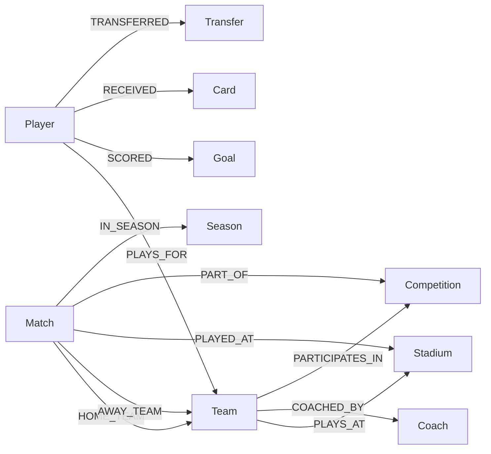

# Data Models

## Entity Models

All entities inherit from `GraphEntity` base class providing common attributes:
- `id: str` - Unique identifier
- `created_at: datetime` - Creation timestamp
- `updated_at: datetime` - Last modification timestamp

---

### Player

Represents a soccer player with comprehensive attributes.

```python
@dataclass
class Player(GraphEntity):
    name: str
    full_name: Optional[str]
    birth_date: Optional[date]
    nationality: Optional[str]
    height: Optional[float]           # in cm
    weight: Optional[float]           # in kg
    position: Optional[PlayerPosition]
    preferred_foot: Optional[str]     # "left", "right", "both"
    jersey_number: Optional[int]

    # Career statistics
    total_goals: int = 0
    total_assists: int = 0
    total_matches: int = 0
    yellow_cards: int = 0
    red_cards: int = 0

    # Performance metrics
    minutes_played: int = 0
    goals_per_game: float = 0.0
    pass_accuracy: float = 0.0
```

**Position Enum:**
| Value | Description |
|-------|-------------|
| GK | Goalkeeper |
| DEF | Defender |
| MID | Midfielder |
| FWD | Forward |
| UNK | Unknown |

---

### Team

Represents a soccer club or national team.

```python
@dataclass
class Team(GraphEntity):
    name: str
    full_name: Optional[str]
    short_name: Optional[str]
    founded_year: Optional[int]
    city: Optional[str]
    state: Optional[str]
    country: str = "Brazil"
    stadium_name: Optional[str]
    team_type: str = "club"           # "club" or "national"

    # Identity
    primary_color: Optional[str]
    secondary_color: Optional[str]
    nickname: Optional[str]

    # Statistics
    total_matches: int = 0
    total_wins: int = 0
    total_draws: int = 0
    total_losses: int = 0
    total_goals_for: int = 0
    total_goals_against: int = 0
```

---

### Match

Represents an individual soccer match.

```python
@dataclass
class Match(GraphEntity):
    date: Optional[date]
    time: Optional[str]
    home_team_id: str
    away_team_id: str
    home_score: Optional[int]
    away_score: Optional[int]
    status: str = "scheduled"         # scheduled, live, finished, postponed

    # Context
    round: Optional[str]
    matchday: Optional[int]
    season_id: Optional[str]
    competition_id: Optional[str]
    stadium_id: Optional[str]

    # Officials
    referee: Optional[str]
    var_referee: Optional[str]

    # Statistics
    attendance: Optional[int]
    home_possession: Optional[float]
    away_possession: Optional[float]
    home_shots: Optional[int]
    away_shots: Optional[int]
```

---

### Competition

Represents a tournament or league.

```python
@dataclass
class Competition(GraphEntity):
    name: str
    full_name: Optional[str]
    type: Optional[CompetitionType]
    country: str = "Brazil"
    tier: Optional[int]               # 1 = top tier
    format: Optional[str]             # round_robin, knockout, group_stage

    total_teams: Optional[int]
    total_rounds: Optional[int]
    has_playoffs: bool = False

    current_season: Optional[str]
    current_champion: Optional[str]
```

**Competition Type Enum:**
| Value | Description |
|-------|-------------|
| LEAGUE | Domestic league |
| CUP | Knockout cup competition |
| INTERNATIONAL | International tournament |
| FRIENDLY | Friendly matches |

---

### Stadium

Represents a soccer venue.

```python
@dataclass
class Stadium(GraphEntity):
    name: str
    city: str
    state: Optional[str]
    country: str = "Brazil"
    capacity: Optional[int]
    opened_year: Optional[int]
    surface: Optional[str]            # grass, artificial, hybrid

    latitude: Optional[float]
    longitude: Optional[float]

    total_matches: int = 0
    record_attendance: Optional[int]
```

---

### Goal

Represents a goal scored in a match.

```python
@dataclass
class Goal(GraphEntity):
    match_id: str
    player_id: str
    team_id: str
    minute: int
    type: str = "goal"                # goal, penalty, own_goal, free_kick
    assist_player_id: Optional[str]

    body_part: Optional[str]          # left_foot, right_foot, head
    situation: Optional[str]          # open_play, corner, counter_attack
```

---

### Transfer

Represents a player transfer between teams.

```python
@dataclass
class Transfer(GraphEntity):
    player_id: str
    from_team_id: Optional[str]
    to_team_id: str
    transfer_date: Optional[date]
    transfer_fee: Optional[float]     # in millions
    contract_duration: Optional[int]  # in years
    transfer_type: Optional[TransferType]
```

**Transfer Type Enum:**
| Value | Description |
|-------|-------------|
| PERMANENT | Permanent transfer |
| LOAN | Loan deal |
| FREE | Free transfer |
| RETURN | Return from loan |

---

## Relationship Types



| Relationship | Source | Target | Description |
|-------------|--------|--------|-------------|
| PLAYS_FOR | Player | Team | Current team affiliation |
| SCORED | Player | Goal | Goal scorer |
| ASSISTED | Player | Goal | Goal assist |
| RECEIVED | Player | Card | Card recipient |
| HOME_TEAM | Match | Team | Home team in match |
| AWAY_TEAM | Match | Team | Away team in match |
| PLAYED_AT | Match | Stadium | Match venue |
| PART_OF | Match | Competition | Competition membership |
| PLAYS_AT | Team | Stadium | Home stadium |
| COACHED_BY | Team | Coach | Current coach |
