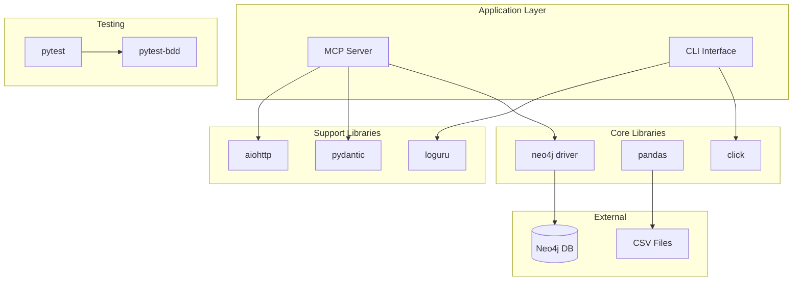

# Dependencies

## Core Dependencies

### MCP Framework
| Package | Version | Purpose |
|---------|---------|---------|
| mcp | 1.0.0 | Model Context Protocol server implementation |

### Graph Database
| Package | Version | Purpose |
|---------|---------|---------|
| neo4j | 5.15.0 | Official Neo4j Python driver |
| py2neo | 2021.2.4 | Object-Graph Mapping (OGM) for Neo4j |

### Data Processing
| Package | Version | Purpose |
|---------|---------|---------|
| pandas | 2.1.4 | DataFrame operations and CSV handling |
| numpy | 1.24.3 | Numerical operations |
| requests | 2.31.0 | HTTP client for API calls |
| beautifulsoup4 | 4.12.2 | HTML/XML parsing |
| lxml | 4.9.3 | XML processing |

### Configuration
| Package | Version | Purpose |
|---------|---------|---------|
| pyyaml | 6.0.1 | YAML configuration parsing |
| python-dotenv | 1.0.0 | Environment variable loading |
| click | 8.1.7 | CLI framework |

### Async Support
| Package | Version | Purpose |
|---------|---------|---------|
| aiohttp | 3.9.1 | Async HTTP client/server |
| aiofiles | 23.2.1 | Async file operations |
| asyncio-mqtt | 0.16.1 | Async MQTT client |

### Testing
| Package | Version | Purpose |
|---------|---------|---------|
| pytest | 7.4.3 | Test framework |
| pytest-bdd | 7.0.0 | BDD testing support |
| pytest-asyncio | 0.21.1 | Async test support |
| pytest-mock | 3.12.0 | Mocking utilities |
| pytest-cov | 4.1.0 | Coverage reporting |

### Data Validation
| Package | Version | Purpose |
|---------|---------|---------|
| pydantic | 2.5.2 | Data validation and settings |
| cerberus | 1.3.5 | Schema validation |

### Logging & Monitoring
| Package | Version | Purpose |
|---------|---------|---------|
| loguru | 0.7.2 | Enhanced logging |
| prometheus-client | 0.19.0 | Metrics collection |

### API Framework
| Package | Version | Purpose |
|---------|---------|---------|
| fastapi | 0.104.1 | Modern web framework |
| uvicorn | 0.24.0 | ASGI server |

### Utilities
| Package | Version | Purpose |
|---------|---------|---------|
| rich | 13.7.0 | Rich text and formatting |
| typer | 0.9.0 | CLI toolkit (alternative to click) |
| tqdm | 4.66.1 | Progress bars |

### Development Tools
| Package | Version | Purpose |
|---------|---------|---------|
| black | 23.11.0 | Code formatting |
| isort | 5.12.0 | Import sorting |
| flake8 | 6.1.0 | Linting |
| mypy | 1.7.1 | Type checking |
| pre-commit | 3.6.0 | Git hooks |

---

## External Services

### Neo4j Database
- **Type:** Graph Database
- **Version:** Community Edition
- **Default URI:** `bolt://localhost:7687`
- **Purpose:** Store and query the soccer knowledge graph

### Data Sources
| Source | Type | Usage |
|--------|------|-------|
| Kaggle | CSV Files | Brazilian Football Matches dataset |
| TheSportsDB | REST API | Enhancement data (optional) |
| API-Football | REST API | Current season data (optional) |

---

## Dependency Graph



---

## Installation

```bash
# Create virtual environment
python -m venv venv
source venv/bin/activate  # or venv\Scripts\activate on Windows

# Install dependencies
pip install -r requirements.txt

# Install Neo4j (if not using Docker)
# See docs/neo4j-setup.md

# Verify installation
python -c "import mcp; import neo4j; print('Dependencies OK')"
```

---

## Compatibility Notes

- **Python:** Requires 3.8 or higher (tested with 3.11)
- **Neo4j:** Compatible with 4.4+ and 5.x
- **OS:** Cross-platform (Windows, macOS, Linux)
- **Architecture:** Supports both x86_64 and ARM64
