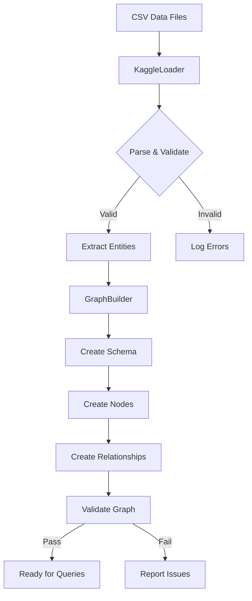
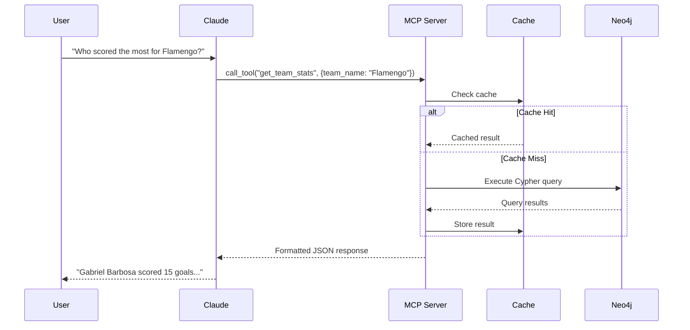
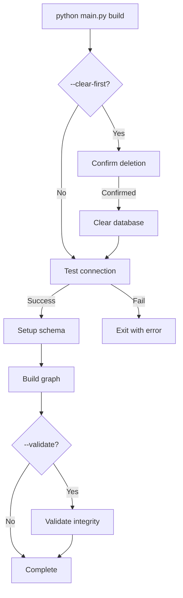
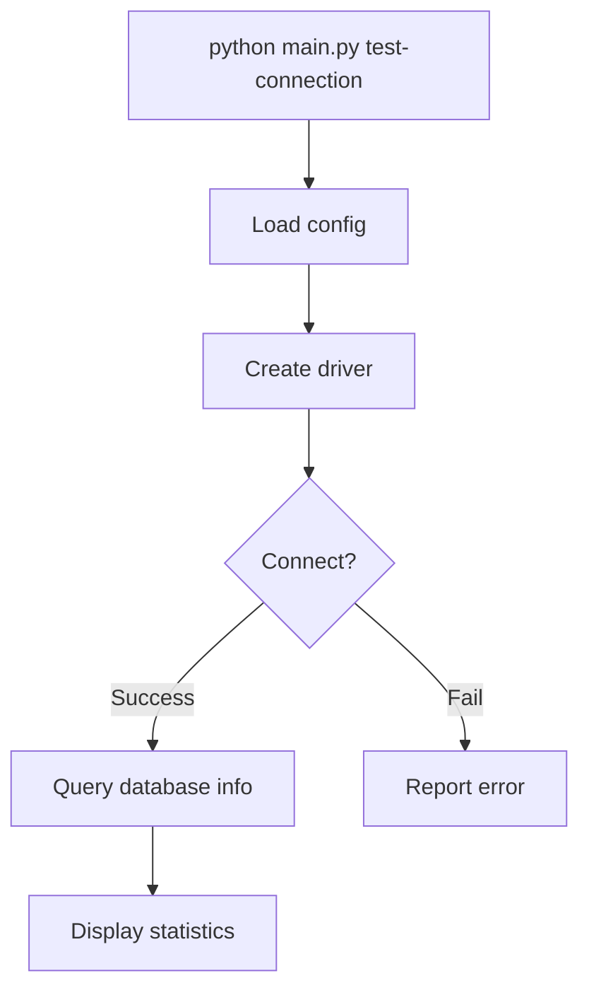
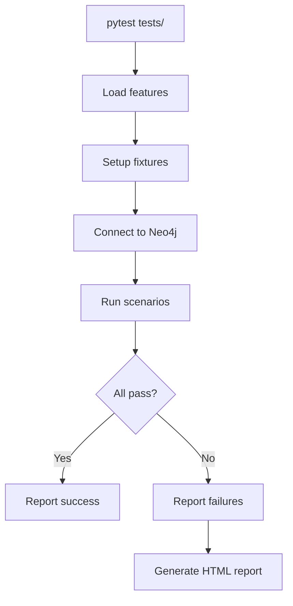
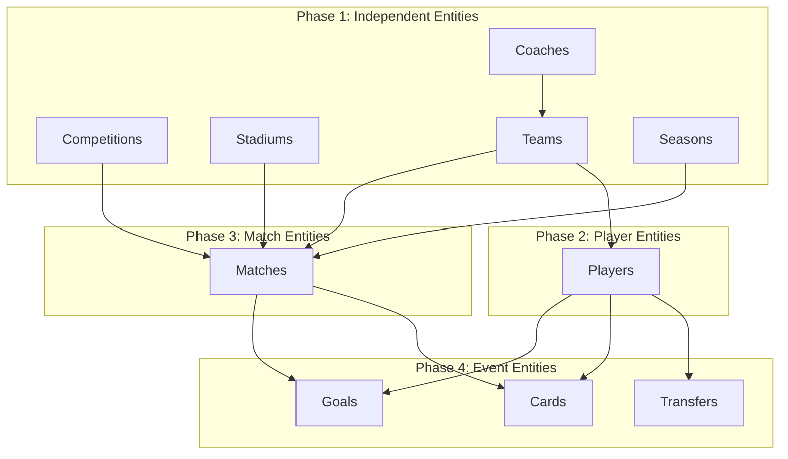
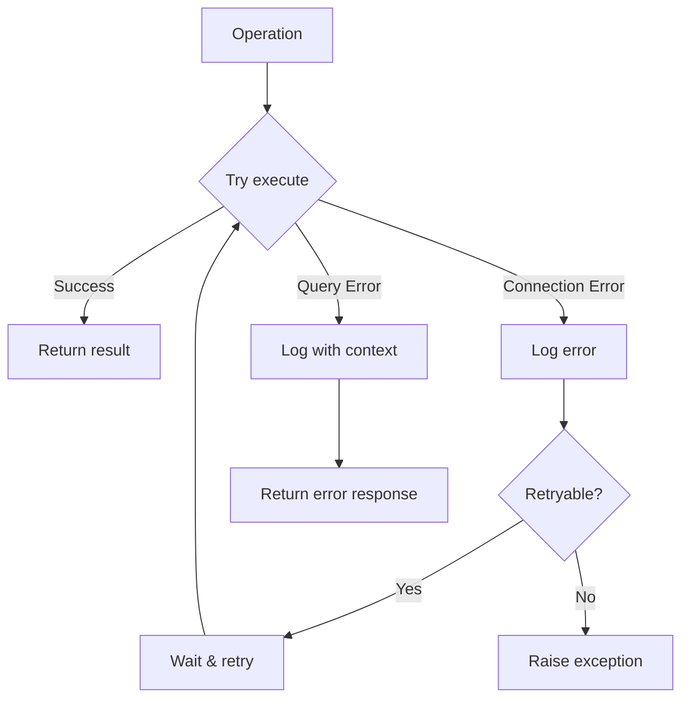
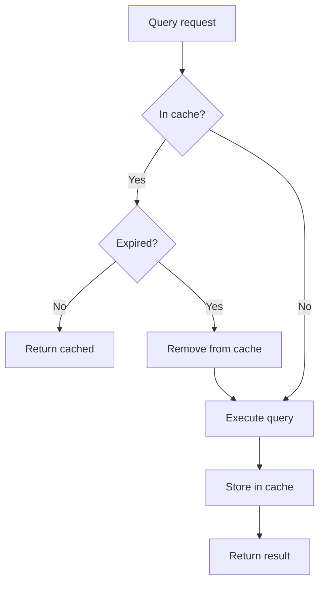

# Workflows

## Data Pipeline Workflow

The complete data pipeline from raw CSV to queryable graph.



### Step 1: Data Loading
```python
loader = KaggleLoader(data_dir="data")
data = loader.load_brazilian_championship_data()
```

### Step 2: Graph Building
```python
builder = GraphBuilder(db_connection)
stats = builder.build_complete_graph(data)
```

### Step 3: Validation
```python
validation = builder.validate_graph_integrity()
```

---

## MCP Query Workflow

How Claude interacts with the knowledge graph.



---

## CLI Workflow

### Build Workflow


### Test Connection Workflow


---

## Testing Workflow

### BDD Test Execution


### Example BDD Scenario
```gherkin
Feature: Player Search
  Scenario: Search for famous Brazilian player
    Given the knowledge graph contains player data
    When I search for "Neymar"
    Then I should get player details with career information
```

---

## Entity Loading Order

The graph builder follows a specific order to handle dependencies:



---

## Error Handling Workflow



---

## Caching Strategy



**Cache Configuration:**
- TTL: 30 minutes
- Key: Query hash + parameters
- Invalidation: On schema changes
