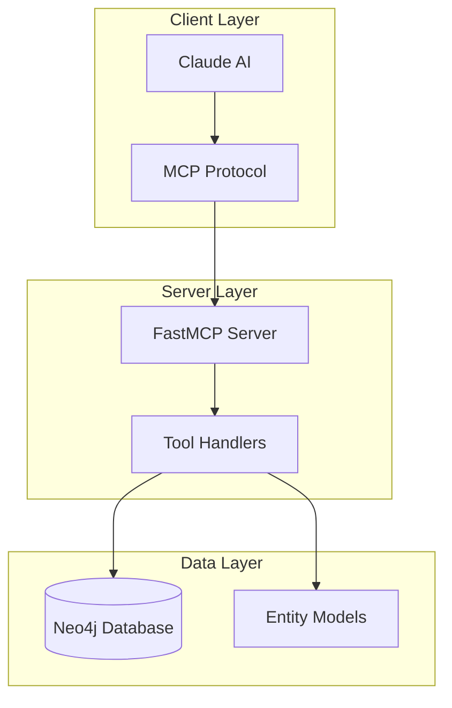
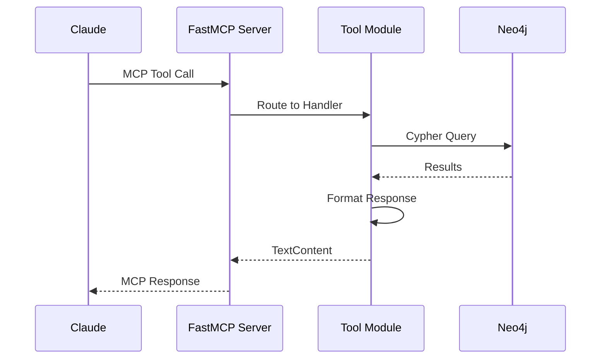
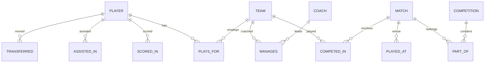

# System Architecture

## Overview

The 2025-10-30-python-hive implementation uses the **Hive orchestration pattern** with Claude-Flow, implementing the SPARC (Specification, Pseudocode, Architecture, Refinement, Completion) methodology.



## Hive Pattern Characteristics

The Hive pattern uses Claude-Flow for agent orchestration:

1. **Parallel Agent Execution:** Multiple agents work concurrently
2. **SPARC Methodology:** Systematic development phases
3. **Memory Coordination:** Shared context via Hive Mind
4. **Hook System:** Pre/post task coordination

## Design Patterns

### 1. FastMCP Server Pattern
Modern async MCP implementation using FastMCP framework:
- Decorator-based tool registration (`@server.call_tool()`)
- Async/await for non-blocking operations
- Structured error handling

### 2. Repository Pattern
Database operations abstracted through `Neo4jConnection`:
- Connection pooling and session management
- Async query execution
- Health checks and monitoring

### 3. Tool Module Pattern
Tools organized by domain:
```
src/tools/
├── player_tools.py     # Player queries
├── team_tools.py       # Team queries
├── match_tools.py      # Match queries
├── competition_tools.py # Competition queries
└── analysis_tools.py   # Analysis queries
```

## Data Flow



## Graph Database Schema



## Key Architectural Decisions

1. **FastMCP over raw MCP:** Simplified server implementation
2. **Async throughout:** Non-blocking database operations
3. **Pydantic models:** Type-safe configuration and validation
4. **BDD testing:** Gherkin scenarios for specification compliance
5. **Domain-based tool organization:** Clear separation of concerns
