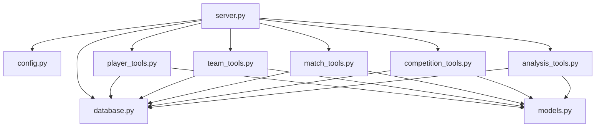

# Components

## Core Components

### 1. MCP Server (`src/server.py`)

The main server component implementing MCP protocol via FastMCP.

**Responsibilities:**
- Initialize MCP server with FastMCP framework
- Register all 18 MCP tools
- Manage database lifecycle (startup/shutdown)
- Route tool calls to appropriate handlers

**Key Features:**
- 900+ lines of implementation
- Decorator-based tool registration
- Async/await throughout
- Structured error handling and logging

### 2. Database Layer (`src/database.py`)

Neo4j connection management and query execution.

**Responsibilities:**
- Establish and maintain database connections
- Execute Cypher queries (async)
- Health checks and monitoring
- Connection pooling

**Key Class:** `Neo4jConnection`
```python
class Neo4jConnection:
    async def connect(self) -> None
    async def close(self) -> None
    async def execute_query(self, query, params) -> List[Dict]
    async def health_check(self) -> Dict[str, Any]
```

### 3. Entity Models (`src/models.py`)

Data models for graph entities using Pydantic.

**Entity Types:**
| Entity | Description |
|--------|-------------|
| Player | Soccer players with stats |
| Team | Soccer clubs |
| Match | Individual matches |
| Competition | Tournaments/leagues |
| Stadium | Soccer venues |
| Coach | Team coaches |

### 4. Configuration (`src/config.py`)

Application configuration using Pydantic Settings.

**Key Settings:**
- `server_name`: MCP server identifier
- `neo4j_uri`: Database connection string
- `neo4j_user`: Database username
- `neo4j_password`: Database password
- `log_level`: Logging configuration

### 5. Tool Modules (`src/tools/`)

Domain-specific MCP tool implementations.

#### Player Tools (`player_tools.py`)
- `search_player(name, team?, position?)`
- `get_player_stats(player_id, season?)`
- `get_player_career(player_id)`
- `get_player_transfers(player_id)`

#### Team Tools (`team_tools.py`)
- `search_team(name)`
- `get_team_roster(team_id, season?)`
- `get_team_stats(team_id, season?)`
- `get_team_history(team_id)`

#### Match Tools (`match_tools.py`)
- `get_match_details(match_id)`
- `search_matches(team?, date_from?, date_to?)`
- `get_head_to_head(team1_id, team2_id)`
- `get_match_scorers(match_id)`

#### Competition Tools (`competition_tools.py`)
- `get_competition_standings(competition_id, season)`
- `get_competition_top_scorers(competition_id, season)`
- `get_competition_matches(competition_id, season)`

#### Analysis Tools (`analysis_tools.py`)
- `find_common_teammates(player1_id, player2_id)`
- `get_rivalry_stats(team1_id, team2_id)`
- `find_players_by_career_path(criteria)`

## Component Dependencies



## Test Components

### conftest.py (400+ lines)
- Neo4j session fixtures (sync & async)
- Test data generators (players, teams, matches)
- Mock MCP client fixtures
- Database cleanup and isolation

### Feature Files (64 scenarios total)
- `player.feature` - 10 scenarios
- `team.feature` - 12 scenarios
- `match.feature` - 13 scenarios
- `competition.feature` - 14 scenarios
- `analysis.feature` - 15 scenarios

### Test Implementation Files
- `test_player_tools.py` - 600+ lines
- `test_team_tools.py` - 500+ lines
- `test_match_tools.py` - 700+ lines
- `test_competition_tools.py` - 400+ lines
- `test_analysis_tools.py` - 350+ lines
- `test_integration.py` - 400+ lines E2E tests
