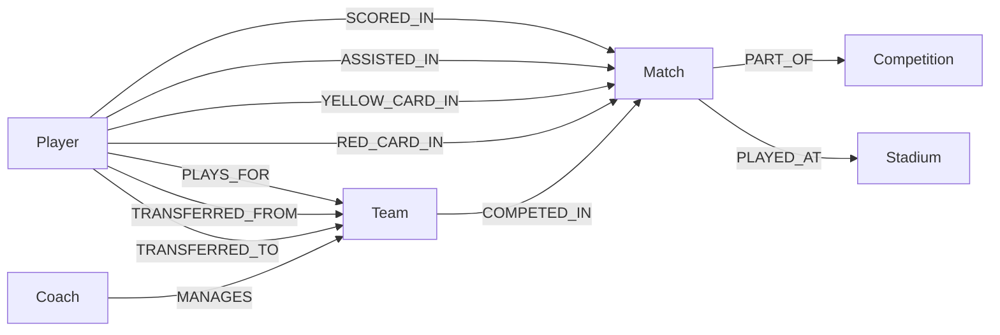

# Data Models

## Entity Models

Based on the specification requirements, the following entities are implemented:

### Player

```python
class Player:
    player_id: str          # Unique identifier
    name: str               # Player name
    birth_date: date        # Date of birth
    nationality: str        # Country of origin
    position: str           # Playing position
    jersey_number: int      # Jersey number
```

### Team

```python
class Team:
    team_id: str            # Unique identifier
    name: str               # Team name
    city: str               # Home city
    stadium: str            # Home stadium name
    founded_year: int       # Year founded
    colors: str             # Team colors
```

### Match

```python
class Match:
    match_id: str           # Unique identifier
    date: date              # Match date
    home_score: int         # Home team score
    away_score: int         # Away team score
    competition: str        # Competition name
    attendance: int         # Match attendance
```

### Competition

```python
class Competition:
    competition_id: str     # Unique identifier
    name: str               # Competition name
    season: str             # Season identifier
    type: str               # league/cup
    tier: int               # Competition tier
```

### Stadium

```python
class Stadium:
    stadium_id: str         # Unique identifier
    name: str               # Stadium name
    city: str               # City location
    capacity: int           # Seating capacity
    opened_year: int        # Year opened
```

### Coach

```python
class Coach:
    coach_id: str           # Unique identifier
    name: str               # Coach name
    nationality: str        # Country of origin
    birth_date: date        # Date of birth
```

---

## Relationship Types

From the specification:



| Relationship | Source | Target | Properties |
|-------------|--------|--------|------------|
| PLAYS_FOR | Player | Team | date_from, date_to |
| SCORED_IN | Player | Match | minute, goal_type |
| ASSISTED_IN | Player | Match | minute |
| YELLOW_CARD_IN | Player | Match | minute |
| RED_CARD_IN | Player | Match | minute |
| TRANSFERRED_FROM | Player | Team | transfer_date, fee |
| TRANSFERRED_TO | Player | Team | transfer_date, fee |
| COMPETED_IN | Team | Match | home/away |
| PART_OF | Match | Competition | round, matchday |
| PLAYED_AT | Match | Stadium | - |
| MANAGES | Coach | Team | date_from, date_to |

---

## Neo4j Schema

### Constraints (Unique IDs)

```cypher
CREATE CONSTRAINT player_id IF NOT EXISTS
FOR (p:Player) REQUIRE p.player_id IS UNIQUE

CREATE CONSTRAINT team_id IF NOT EXISTS
FOR (t:Team) REQUIRE t.team_id IS UNIQUE

CREATE CONSTRAINT match_id IF NOT EXISTS
FOR (m:Match) REQUIRE m.match_id IS UNIQUE

CREATE CONSTRAINT competition_id IF NOT EXISTS
FOR (c:Competition) REQUIRE c.competition_id IS UNIQUE

CREATE CONSTRAINT stadium_id IF NOT EXISTS
FOR (s:Stadium) REQUIRE s.stadium_id IS UNIQUE

CREATE CONSTRAINT coach_id IF NOT EXISTS
FOR (co:Coach) REQUIRE co.coach_id IS UNIQUE
```

### Indexes

```cypher
CREATE INDEX player_name IF NOT EXISTS FOR (p:Player) ON (p.name)
CREATE INDEX team_name IF NOT EXISTS FOR (t:Team) ON (t.name)
CREATE INDEX match_date IF NOT EXISTS FOR (m:Match) ON (m.date)
CREATE INDEX competition_name IF NOT EXISTS FOR (c:Competition) ON (c.name)
```
