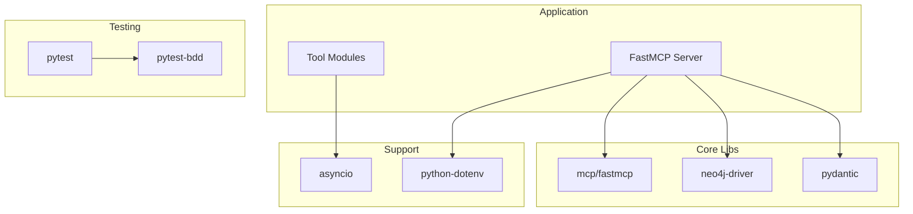

# Dependencies

## Core Dependencies

### MCP Framework
| Package | Version | Purpose |
|---------|---------|---------|
| mcp | >=0.9.0 | MCP protocol implementation |
| fastmcp | >=0.2.0 | FastMCP server framework |

### Graph Database
| Package | Version | Purpose |
|---------|---------|---------|
| neo4j | >=5.14.0 | Neo4j Python driver |
| neo4j-driver | >=5.14.0 | Direct driver access |

### Data Validation
| Package | Version | Purpose |
|---------|---------|---------|
| pydantic | >=2.5.0 | Data validation and models |
| pydantic-settings | >=2.1.0 | Configuration management |
| python-dotenv | >=1.0.0 | Environment variable loading |

### Async Support
| Package | Version | Purpose |
|---------|---------|---------|
| asyncio | >=3.4.3 | Async runtime |
| aiofiles | >=23.2.1 | Async file operations |

### Logging
| Package | Version | Purpose |
|---------|---------|---------|
| python-json-logger | >=2.0.7 | Structured JSON logging |

### Type Hints
| Package | Version | Purpose |
|---------|---------|---------|
| typing-extensions | >=4.9.0 | Extended typing support |

---

## Testing Dependencies

| Package | Version | Purpose |
|---------|---------|---------|
| pytest | >=7.4.3 | Test framework |
| pytest-asyncio | >=0.21.1 | Async test support |
| pytest-cov | >=4.1.0 | Coverage reporting |
| pytest-bdd | (implied) | BDD testing |
| faker | (implied) | Test data generation |

---

## Development Tools

| Package | Version | Purpose |
|---------|---------|---------|
| black | >=23.12.0 | Code formatting |
| ruff | >=0.1.8 | Fast linting |
| mypy | >=1.7.1 | Type checking |

---

## External Services

### Neo4j Database
- **Type:** Graph Database
- **Version:** 5.14.0+
- **Default URI:** `bolt://localhost:7687`

### Data Sources (from spec)
- Kaggle Brazilian Football Matches dataset
- TheSportsDB (optional enhancement)
- API-Football (optional enhancement)

---

## Dependency Graph



---

## Installation

```bash
# Create virtual environment
python -m venv venv
source venv/bin/activate

# Install dependencies
pip install -r requirements.txt

# Verify installation
python -c "import mcp; import neo4j; print('OK')"
```

---

## Compatibility

- **Python:** 3.8+ required
- **Neo4j:** 5.14.0+ recommended
- **OS:** Cross-platform (Windows, macOS, Linux)
